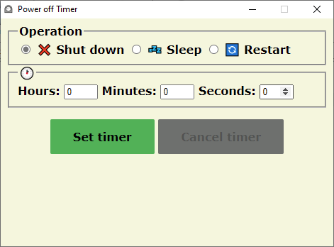
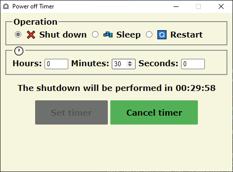

Power off Timer
============
[](https://github.com/dmliasko/power-off-timer/actions/workflows/main.yml)

Simple cross-platform shut down/sleep/restart timer written in Python.

## Screenshots



## Built with
- [Python 3.8](https://www.python.org/downloads/release/python-380/)
- [Pywebview](https://pywebview.flowrl.com/blog/pywebview3.html) - lets you to build GUI for your Python program using HTML, CSS and Javascript, while doing its best hiding the fact that the GUI is built using a browser
- [Pyinstaller](https://www.pyinstaller.org/) - freezes (packages) Python applications into stand-alone executables, under Windows, GNU/Linux, Mac OS X, FreeBSD, Solaris and AIX.

## Setup
The primary you will need to install `pywebview` and `pyinstaller` packages:

```sh
$ pip install pywebview
$ pip install pyinstaller
```
Make sure your Python version is not newer than `Python 3.8`

```sh
$ python -V
Python 3.8.0
```

In order to create a single executable you need to run `pyinstaller` tool in terminal opened from the `src` directory of the project:

```sh
$ pyinstaller --onefile --clean  --add-data="assets/index.html;assets" --add-data="assets/styles.css;assets" --add-data="assets/script.js;assets"  main.py
```

